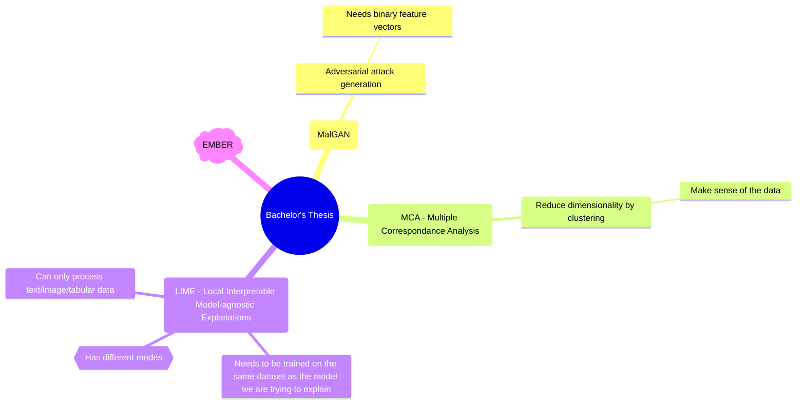

# Bachelor Topics

## Task List

<!-- 
    Issue URL: https://github.com/onlyidev/bachelor/issues/8
-->
- [x] Register topic until 02-18 
<!--
    TODO: fix by 2025-03-06
    Issue URL: https://github.com/onlyidev/bachelor/issues/7
    milestone: Thesis Plan
 -->
- [ ] Submit a plan for the Thesis until 03-06 
<!--
    TODO: fix by 2025-04-28 
    Issue URL: https://github.com/onlyidev/bachelor/issues/6
    milestone: Professional Practice
-->
- [ ] Submit practice report until 04-28 

## Mind Map

## Notes

### LIME

- Detector and LIME need to be trained on the same dataset together (EMBER)
- LIME needs different features than the detector (processed by MCA)
