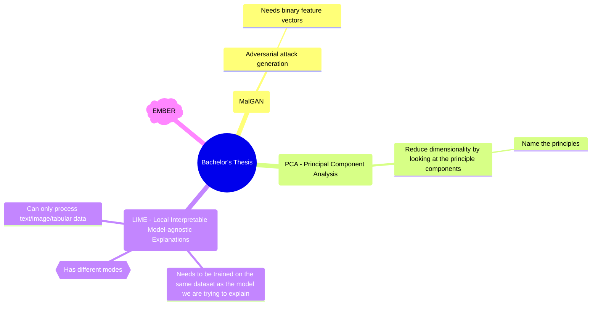

# Bachelor Topics

## Task List

- [x] Register topic until 02-18

## Mind Map

## Notes

### LIME

- Detector and LIME need to be trained on the same dataset together (EMBER)
- LIME needs different features than the detector (processed by PCA)
