# Bachelor Topics

## Task List

<!-- 
    Issue URL: https://github.com/onlyidev/bachelor/issues/8
-->
- [x] Register topic until 02-18 
<!--
    Issue URL: https://github.com/onlyidev/bachelor/issues/7
    milestone: Thesis Plan
 -->
- [x] Submit a plan for the Thesis until 03-06 
<!--
    TODO: fix by 2025-04-28 
    Issue URL: https://github.com/onlyidev/bachelor/issues/6
    milestone: Professional Practice
-->
- [ ] Submit practice report until 04-28 

<!-- 
    TODO: Adjust Thesis topic by 2025-04-30
    milestone: Thesis Completed
 -->
- [ ] Adjust Thesis topic by 04-30 

<!-- 
    TODO: Complete Thesis by 2025-05-07
    milestone: Thesis Completed
 -->
- [ ] Complete Thesis by 05-07 

## Mind Map

## Notes

### LIME

- Detector and LIME need to be trained on the same dataset together (EMBER/SLEIPNIR)
- LIME needs different features than the detector (processed by MCA)

## Plan

```mermaid
flowchart
data("Acquire dataset - SLEIPNIR ✅")
train("Train MalGAN 🔷")
mca("Train MCA 🔷")
classify("Train classifier on MCA data 🔷")
validate("Validate classifier performance 🔶")
collect("Use LIME to collect a normal set of features 🔷")
lime("Create component that uses LIME explanations to verify that classification is Benign 🔷")
exp1["Experiment - measure normal classifier (no MCA) stats 🔷"]
exp2["Experiment - measure adjusted classifier (with MCA) stats 🔷"]
exp3["Experiment - measure adjusted classifier (without MCA) stats 🔷"]
plots("Prepare experiment plots 🔷")
visual("Visualize modified process 🔶")
inertia("Calculate inertia for MCA 🔷")

data --> train
data --> mca --> classify --> validate
classify --> collect
train --> exp1
train --> exp2
collect --> lime --> exp2
exp2 --> exp3

subgraph Legend
legend("`
✅ -- DONE
🔷 -- In progress
🔶 -- Not Started
`")
end

classDef left text-align:left;
class legend left

```

